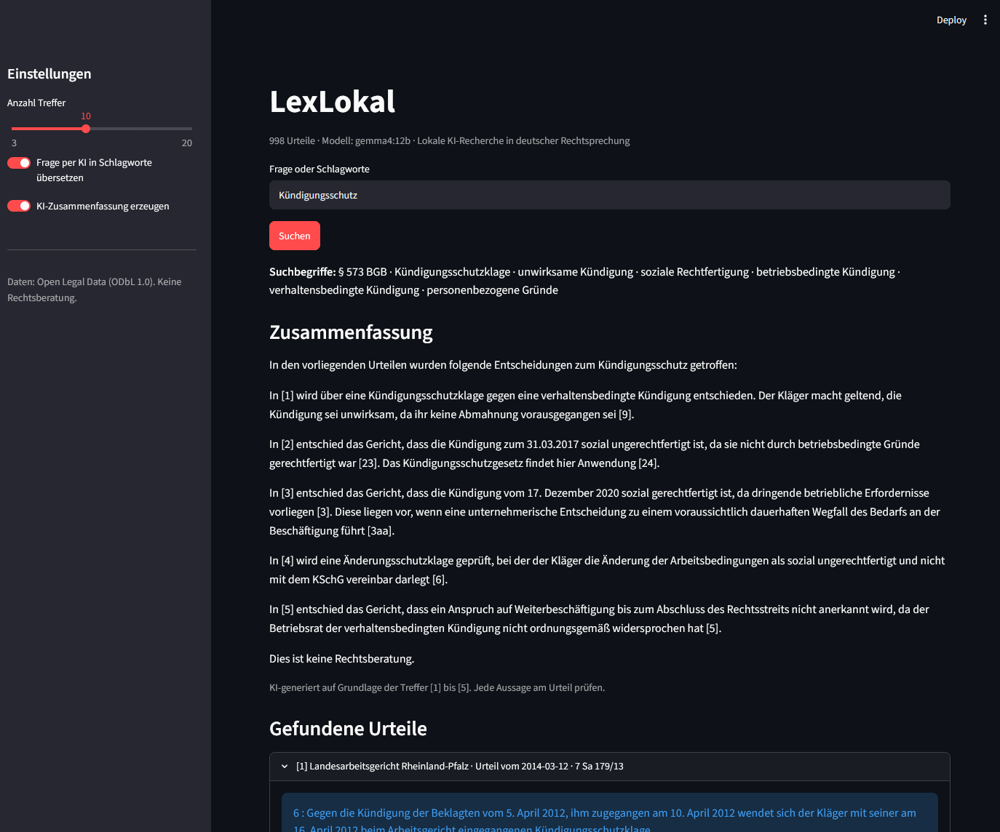
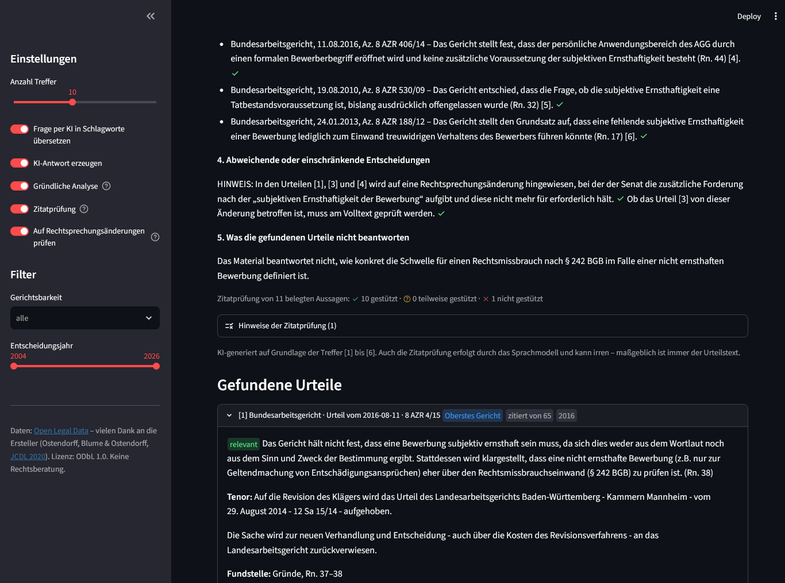
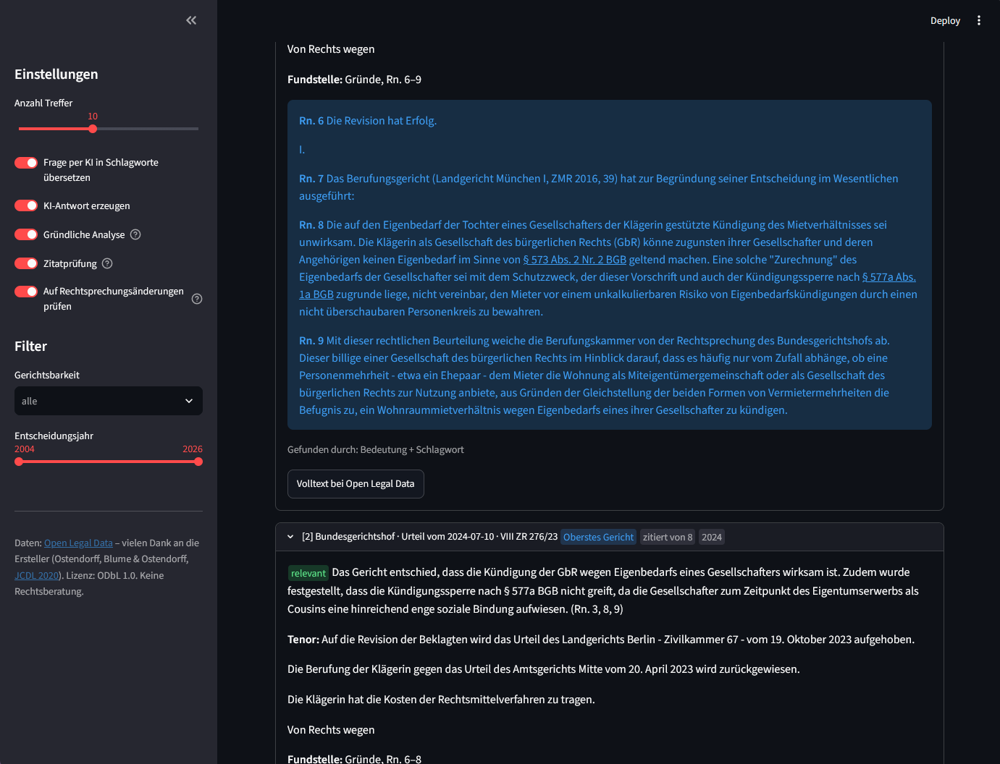

# CaseLocal - lokale KI-Recherche in deutscher Rechtsprechung

[](https://github.com/L0enneberga/CaseLocal/actions/workflows/tests.yml)

Recherche in den 10.000 bedeutendsten deutschen Gerichtsentscheidungen – mit hybrider Suche, gegliederter KI-Antwort und einer Zitatprüfung, die nicht belegte Aussagen sichtbar macht. **Alles läuft lokal**: Kein Text verlässt den Rechner, und es entstehen keine API-Kosten.

> **Datengrundlage:** CaseLocal nutzt den Urteilsdatensatz von [Open Legal Data](https://openlegaldata.io) (Ostendorff, Blume & Ostendorff, 2020). Das Sammeln, Aufbereiten und offene Bereitstellen von über 400.000 Gerichtsentscheidungen ist ihre Arbeit, nicht meine. Herzlichen Dank dafür! Details und Zitat: [Datengrundlage und Dank](#datengrundlage-und-dank).

**Gegliederte Antwort:** Kurzantwort, einschlägige Normen und Rechtsprechung mit Randnummern. Jede belegte Aussage ist gegen das zitierte Urteil geprüft: gestützt (✓), nicht gestützt (rot markiert).



**Rechtsprechungsänderungen und Zitatprüfung:** Die Antwort weist darauf hin, wenn ein Gericht seine frühere Linie aufgegeben hat. Darunter steht die Bilanz der Zitatprüfung, die Treffer zeigen Instanz, Zitierhäufigkeit und Jahr.



**Fundstelle im Urteil:** der passende Abschnitt der Gründe mit Randnummern und verlinkten Normen. Urteile, die die KI-Einzelprüfung als nicht einschlägig einstuft, werden als „aussortiert“ gekennzeichnet.



## Was das Projekt kann

Der Schwerpunkt liegt auf **nachprüfbaren Antworten**: Das Sprachmodell soll nicht nur zusammenfassen, sondern zeigen, worauf sich jede Aussage stützt, und kenntlich machen, wo das nicht gelingt.

- **Die bedeutendsten 10.000 Urteile statt einer Zufallsstichprobe**: Über den Zitationsgraphen von Open Legal Data (rund 7,4 Millionen Zitierungen) bekommt jedes der 424.000 Urteile einen Bedeutungs-Score: Zitierungen, gewichtet nach der Instanz des zitierenden Gerichts, geteilt durch das Alter, mal einem Faktor für die eigene Instanz. Kontingente sorgen dafür, dass auch neue Grundsatzentscheidungen, Instanzgerichte und jede Gerichtsbarkeit vertreten sind (siehe [Auswahl](#auswahl-der-urteile)).
- **Gewichten und kennzeichnen statt aussortieren**: Bedeutung und Aktualität fließen in die Rangfolge ein, die Relevanz zur Frage bleibt entscheidend. Jeder Treffer zeigt Instanz, „zitiert von N Entscheidungen“ und Jahr.
- **Hinweis auf Rechtsprechungsänderungen**: Zitiert ein neueres Urteil gleicher oder höherer Instanz einen Treffer mit Formulierungen wie „hält nicht mehr fest“ oder „in Abkehr von“, prüft das Modell, ob dort wirklich eine Änderung der Rechtsprechung erörtert wird. Dann erscheint am Treffer ein Prüfhinweis mit der Originalstelle, und in Abschnitt 4 der Antwort setzt der Code einen festen Block: welche Entscheidung die Änderung beschreibt und welche früheren Treffer sie dabei zitiert. Ob ein Treffer die alte oder die neue Linie vertritt, entscheidet bewusst der Mensch: Im Test an 40 echten Fällen lag das Sprachmodell dabei etwa jedes zweite Mal falsch.
- **Zitatprüfung gegen Halluzinationen**: Ein zweiter Durchgang prüft jeden Satz der Antwort gegen das Urteil, das er zitiert. Gestützte Aussagen erhalten ein Häkchen, teilweise oder nicht gestützte werden farbig markiert und begründet. Zitiert ein Satz mehrere Urteile, müssen alle ihn tragen, sonst gilt er als teilweise gestützt, und die nicht tragende Quelle wird genannt. Hinweissätze („muss am Volltext geprüft werden“, offene Punkte) werden nicht mitgezählt.
- **Vorinstanz und Gericht auseinanderhalten**: Revisionsurteile geben oft zuerst die Begründung der Vorinstanz wieder („Das Berufungsgericht hat ausgeführt …“) und verwerfen sie danach. CaseLocal erkennt diese Passagen, kennzeichnet ihre Randnummern als „Wiedergabe der Vorinstanz“ und gibt dem Modell zusätzlich die eigene Bewertung des Gerichts mit. So wird die Meinung der Vorinstanz nicht dem Bundesgericht zugeschrieben, und die Zitatprüfung erkennt, wenn es doch passiert.
- **Gericht, Datum und Aktenzeichen aus der Datenbank**: Das Modell verweist nur mit [n], der Code setzt die Angaben ein. Vorher verschrieb sich das Modell in 6 von 13 Testantworten beim Datum, meist mit „20.“ statt des richtigen Tages. Was trotzdem im Text auftaucht, wird mit der Datenbank abgeglichen und korrigiert.
- **Unionsrechtliche Bezüge**: Verweist ein Urteil in den zitierten Randnummern auf eine EuGH-Vorlage („8 AZR 848/13 (A)“), eine Rechtssache („C-423/15“) oder eine Richtlinie, nennt Abschnitt 5 das ausdrücklich. Rechtssachen sind auf curia.europa.eu verlinkt. Dazu kommt der Hinweis, dass EuGH-Entscheidungen nicht im Bestand sind.
- **Messbar statt gefühlt**: 13 Testfragen mit erwartetem Leiturteil (`tests/goldfragen.json`) laufen mit `bewertung.py` durch die ganze Kette. Gemessen werden Rang des Leiturteils, Metadatenfehler, Zitatprüfung und Dauer (siehe [Messung](#messung)).
- **Zweistufige Analyse**: Das Modell prüft zuerst jedes gefundene Urteil einzeln (beantwortet es die Frage? was wurde im konkreten Fall entschieden? welche Randnummer?) und sortiert unpassende aus. Erst aus diesen Einzelprüfungen entsteht die Antwort.
- **Gegliederte Antwort nach juristischer Arbeitsweise**: Kurzantwort, einschlägige Normen, Rechtsprechung mit Randnummern, abweichende Entscheidungen und was die Urteile *nicht* beantworten. Einzelfall und Rechtssatz werden getrennt, höhere Instanzen und neuere Entscheidungen zuerst.
- **Suche entlang der Urteilsgliederung**: Urteile werden an Tenor, Tatbestand und Gründen zerlegt, Randnummern bleiben erhalten. Die Gründe zählen bei der Suche mehr als der Parteivortrag im Tatbestand. Zu jedem Treffer bekommt das Modell Leitsatz, Tenor und den Kontext rund um die Fundstelle.
- **Hybride Suche**: kombiniert klassische Volltextsuche (SQLite FTS5, BM25) mit semantischer Suche über Embeddings (ChromaDB), zusammengeführt per *Reciprocal Rank Fusion*.
- **KI-Schlagworte**: ein lokales Sprachmodell übersetzt Fragen in juristische Suchbegriffe und verschlagwortet Urteile automatisch.
- **Antworten mit Fundstellen (RAG)**: das Modell antwortet nur auf Grundlage der gefundenen Urteile und zitiert sie mit Nummer und Aktenzeichen.
- **Filter**: Suche auf Gerichtsbarkeiten und einen Zeitraum eingrenzen.
- **Gesetzestexte im Wortlaut**: Die 100 in den Urteilen meistzitierten Bundesgesetze liegen mit Wortlaut und Stand lokal vor (siehe [Gesetzestexte](#gesetzestexte)). Unter „Einschlägige Normen“ lässt sich jede Norm aufklappen. Das Modell bekommt den Wortlaut der wichtigsten Normen mit, darf aber nur Urteilen eine Auslegung entnehmen. Erfundene Paragraphen („§ 999 AGG“) werden rot markiert. Passt keine Rechtsprechung, schlägt eine Normsuche mögliche Normen vor, ohne KI-Einschätzung.
- **Normen verlinken**: Zitate wie „§ 573 Abs. 2 BGB“ oder „Art. 3 GG“ werden erkannt und auf gesetze-im-internet.de verlinkt. Jede Trefferkarte zeigt die Normen, die das Urteil am häufigsten zitiert.

## Architektur

```
Open Legal Data ──► daten_laden.py ──► SQLite (Metadaten + FTS5-Index)
                                          │
                    index_bauen.py ───────┴──► ChromaDB (Embeddings via bge-m3)
                    schlagworte.py ──► LLM vergibt Schlagworte + Kurzfassung

Frage ──► LLM: Suchbegriffe ──► hybride Suche ──► LLM: Einzelprüfung je Urteil
                                                          │
                                         LLM: gegliederte Antwort, Belege nur als [n]
                                                          │
          Code: Gericht/Datum/Az. aus der Datenbank, Rechtsprechungsänderungen, Unionsrecht
                                                          │
                          Streamlit ◄── LLM: Zitatprüfung je Satz
```

| Datei | Aufgabe |
| --- | --- |
| `config.py` | Alle Einstellungen (Modelle, Pfade, Datenmenge) |
| `auswahl.py` | Wählt die bedeutendsten Urteile über den Zitationsgraphen aus |
| `daten_laden.py` | Lädt die Urteile von Hugging Face in SQLite |
| `gliederung.py` | Erkennt Tenor, Tatbestand, Gründe, Randnummern und die Wiedergabe der Vorinstanz |
| `index_bauen.py` | Teilt Urteile entlang der Gliederung in Abschnitte, berechnet Embeddings |
| `schlagworte.py` | Optional: KI-Verschlagwortung |
| `suche.py` | Schlagwort-, semantische und hybride Suche, Filter |
| `gesetze_laden.py` | Lädt die meistzitierten Bundesgesetze von gesetze-im-internet.de, baut die Normsuche |
| `normen.py` | Erkennt Normzitate, schlägt ihren Wortlaut nach und verlinkt sie |
| `llm.py` | Prompts und Aufrufe an das Sprachmodell (Einzelprüfung, Antwort, Zitatprüfung) |
| `belege.py` | Zerlegt die Antwort in Sätze, prüft Belege und Metadaten, markiert das Ergebnis |
| `ergaenzung.py` | Ergänzt die Antwort per Code: Urteilskopf aus der Datenbank, Block zu Rechtsprechungsänderungen, Unionsrecht |
| `abweichung.py` | Sucht neuere Urteile, die im Zusammenhang mit einem Treffer eine Rechtsprechungsänderung erörtern |
| `app.py` | Weboberfläche (Streamlit) |
| `bewertung.py` | Misst die Qualität an den Testfragen in `tests/goldfragen.json` |
| `tests/` | Automatische Tests (pytest), laufen bei jedem Push auf GitHub |

## Technik

Python · [Ollama](https://ollama.com) · Gemma 4 12B · bge-m3 · ChromaDB · SQLite FTS5 · Streamlit

Getestet auf: Windows 11, RTX 4080 Super (16 GB VRAM), 32 GB RAM.

**Kein Fine-Tuning:** Das Sprachmodell ist ein unverändertes Gemma 4 12B. Die Qualität entsteht durch Prompt-Engineering und eine mehrstufige Pipeline: Das Modell übernimmt, was Sprachverständnis braucht (Relevanz prüfen, Antwort formulieren, Belege prüfen). Code übernimmt, was Code zuverlässiger kann (Metadaten, Gliederung, Rechtsprechungsänderungen, Unionsrecht).

## Schnellstart unter Windows

Voraussetzungen: [Python](https://www.python.org/downloads/) 3.11+ und [Ollama](https://ollama.com/download) sind installiert, und auf der [Datensatzseite](https://huggingface.co/datasets/openlegaldata/court-decisions-germany) sind die Zugangsbedingungen akzeptiert (kostenloser Hugging-Face-Account).

1. **`setup.bat`** doppelklicken – einmalig. Legt die virtuelle Umgebung an, installiert die Bibliotheken, lädt die Modelle aus `config.py` und die Urteile und baut den Suchindex. Fehlt etwas, erklärt das Skript, was zu tun ist; danach einfach erneut starten, Erledigtes wird übersprungen.
2. **`start.bat`** doppelklicken – bei jeder Nutzung. Prüft, ob alles bereit ist, startet Ollama bei Bedarf und öffnet die App im Browser.

## Installation von Hand

Voraussetzungen: Python 3.11+, [Ollama](https://ollama.com/download), ein Hugging-Face-Account mit akzeptierten Bedingungen für den [Datensatz](https://huggingface.co/datasets/openlegaldata/court-decisions-germany).

```bash
git clone https://github.com/L0enneberga/CaseLocal.git
cd CaseLocal
python -m venv .venv
.venv\Scripts\activate          # macOS/Linux: source .venv/bin/activate
pip install -r requirements.txt

ollama pull bge-m3
ollama pull gemma4:12b
hf auth login                    # Hugging-Face-Token eingeben
```

## Benutzung

```bash
python daten_laden.py            # 1. die 10.000 bedeutendsten Urteile auswählen und laden (ca. 3 GB)
python index_bauen.py            # 2. Suchindex bauen (ca. 2-3 Stunden, kann unterbrochen werden)
python gesetze_laden.py          # 3. die 100 meistzitierten Bundesgesetze laden (ca. 15 Minuten)
python schlagworte.py --anzahl 100   # 4. optional: KI-Schlagworte
streamlit run app.py             # 5. App starten -> http://localhost:8501
```

## Auswahl der Urteile

Statt einer Zufallsstichprobe lädt CaseLocal gezielt die bedeutendsten Urteile aus dem Vollbestand. Dafür werden zuerst nur der Zitationsgraph und die Metadaten aller Urteile gelesen (rund 120 MB statt 10 GB), dann der Score berechnet und erst danach die Volltexte der Auswahl geladen.

| Kontingent | Anzahl | Warum |
| --- | --- | --- |
| Neue Urteile oberster Gerichte (letzte 5 Jahre) | 2.000 | Neue Grundsatzentscheidungen hatten noch keine Zeit, oft zitiert zu werden |
| Instanzgerichte (OLG, OVG, LAG, LG, VG, ...) | 1.500 | Die tägliche Praxis wird auch von Instanzgerichten geprägt |
| Mindestens je Gerichtsbarkeit | 400 | Auch seltener zitierte Gebiete wie das Steuerrecht sind vertreten |
| Rest nach Bedeutungs-Score | bis 10.000 | Die meistzitierten Entscheidungen |

Alle Zahlen lassen sich in `config.py` ändern. Mit `DATENAUSWAHL = "stichprobe"` arbeitet CaseLocal wieder mit der Zufallsstichprobe.

**Warum veraltete Urteile nicht einfach aussortiert werden:** Neuer heißt nicht maßgeblicher – eine BGH-Grundsatzentscheidung von 2005 kann heute noch die Linie bestimmen. Die herrschende Meinung steckt zudem vor allem in der Literatur, die im Datenbestand fehlt. Und „pro Rechtsfrage nur das Neueste“ setzt voraus, Rechtsfragen zuverlässig zu erkennen; beim Aussortieren verschwänden womöglich gerade die tragenden Entscheidungen. CaseLocal gewichtet deshalb, kennzeichnet und warnt, statt auszuschließen.

## Tests

```bash
pip install -r requirements-dev.txt
pytest
```

Die Tests prüfen die Bausteine, die ohne Daten und ohne Ollama funktionieren (die Qualität der KI-Antworten misst `bewertung.py`, siehe [Messung](#messung)): Bedeutungs-Score und Kontingente der Auswahl, Erkennen der Urteilsgliederung und Randnummern, Zerlegen in Abschnitte, FTS5-Anfragen, Filter und Rangfolge, Satzzerlegung und Markierung der Zitatprüfung, Vorauswahl für Rechtsprechungsänderungen, das Einsetzen und Korrigieren von Gericht, Datum und Aktenzeichen, der Block zu Rechtsprechungsänderungen und das Erkennen von Normzitaten und unionsrechtlichen Bezügen.

## Gesetzestexte

`gesetze_laden.py` lädt den Wortlaut der Bundesgesetze, die in den 10.000 Urteilen am häufigsten zitiert werden, als XML von [gesetze-im-internet.de](https://www.gesetze-im-internet.de), dem Portal des Bundesministeriums der Justiz. Welche Gesetze das sind, ergibt sich aus dem Zitationsgraphen (Kanten Urteil → Norm) und einer eigenen Zählung der Normzitate in den Urteilstexten. Die eigene Zählung ist nötig, weil der Graph Schreibweisen wie „§ 31a SGB II“ kaum erkennt. Ein erneuter Aufruf lädt nur Gesetze, deren Datei sich geändert hat (`setup.bat` erledigt das mit).

**Grundsatz:** Der Wortlaut wird per Code nachgeschlagen, nie vom Sprachmodell erzeugt. Das Modell darf ihn zitieren, eine Auslegung aber nur aus den Urteilen ableiten (mit Beleg [n]).

| Wo | Was |
| --- | --- |
| Antwort, Abschnitt 2 | Jede genannte Norm zum Aufklappen: Wortlaut (bei „Abs. 2“ nur dieser Absatz), Stand, Link |
| Material für das Modell | Wortlaut der bis zu 5 Normen, die die Einzelprüfung am häufigsten nennt, je höchstens 1.200 Zeichen (`NORMEN_MAX`, `NORMTEXT_ZEICHEN`) |
| Prüfung der Antwort | Paragraphen, die es im geladenen Gesetz nicht gibt, werden rot markiert. Nicht geladene Gesetze (z. B. DSGVO) bekommen nur einen grauen Hinweis. |
| Trefferkarte | Normen, die das Urteil am häufigsten zitiert, mit Link |
| Keine passende Rechtsprechung | Normsuche über Embeddings: die 5 ähnlichsten Normen mit Wortlaut, ohne KI-Einschätzung |

**Grenzen:**

- **Wortlaut ist nicht Auslegung.** Aus dem Wortlaut von § 6 AGG allein wäre die Rechtsmissbrauchsfrage aus dem AGG-Beispiel nicht erkennbar. Rechtsauffassungen kommen deshalb nur aus Urteilen.
- **Heutige Fassung.** Ein Urteil von 2012 hat die damals geltende Fassung angewendet. Die App zeigt den heutigen Stand und sagt das bei jeder Norm. Historische Fassungen bietet gesetze-im-internet.de nicht.
- **Nur Bundesrecht, nur die meistzitierten Gesetze.** Landesrecht und EU-Recht (DSGVO, Richtlinien) fehlen, ebenso seltener zitierte Bundesgesetze (`GESETZE_ANZAHL` in `config.py`).
- **Konsolidierung mit Verzögerung.** gesetze-im-internet.de arbeitet Änderungen nicht immer sofort ein. Der angezeigte Stand macht das transparent.
- **Normsuche ist keine Subsumtion.** Sie findet Normen nach sprachlicher Ähnlichkeit zur Frage. Ob eine Norm anwendbar ist, sagt sie nicht.

Gesetze sind nach § 5 UrhG gemeinfrei. Wie die Urteile sind die Gesetzestexte nicht Teil dieses Repositorys, jede Installation lädt sie selbst.

## Messung

13 Testfragen aus Arbeits-, Miet-, Werkvertrags-, Bank-, Sozial-, Verfassungs- und Datenschutzrecht, je mit erwartetem Leiturteil und Kernaussage (`tests/goldfragen.json`). `bewertung.py` schickt jede Frage durch die ganze Kette, so wie die App: Suche, Prüfung auf Rechtsprechungsänderungen, Einzelprüfung, Antwort, Zitatprüfung.

```bash
python bewertung.py --name nachher                          # alle Fragen
python bewertung.py --name denken --denken-pruefung ja      # mit Denkmodus in den Prüfschritten
```

| Stand | Leiturteil unter den Top 5 | Leiturteil zitiert | Falsches Datum oder Az. | Aussagen gestützt | teilweise | nicht gestützt | Dauer je Frage |
| --- | --- | --- | --- | --- | --- | --- | --- |
| Vorher | 10/13 | 11/13 | 6 | 93 % (114/122) | 3 | 5 | 30 s |
| Nach Fehlerbehebung (Metadaten, strengere Zitatprüfung, Abschnitt 4 und Unionsrecht per Code) | 10/13 | 11/13 | **0** | 85 % (87/102) | 11 | 4 | 27 s |
| Zusätzlich Denkmodus in den Prüfschritten | 10/13 | 11/13 | 0 | 61 % (60/99) | 18 | 7 | 180 s |

So sind die Zahlen zu lesen:

- **Falsches Datum oder Az.:** Vorher verschrieb sich das Modell in 6 von 13 Antworten beim Datum, jedes Mal mit „20.“ als Tag (etwa 20.02.2018 statt 22.02.2018). Seit der Code den Urteilskopf aus der Datenbank einsetzt, kommt das nicht mehr vor.
- **Weniger „gestützt“ heißt hier strenger, nicht schlechter:** Ein Satz mit mehreren Quellen gilt jetzt nur noch als gestützt, wenn alle ihn tragen. Hinweissätze werden nicht mehr mitgezählt. Die zusätzlichen „teilweise“ betreffen meist Normen-Stichpunkte, die mehr Urteile zitieren als nötig.
- **Denkmodus:** Für einen fairen Vergleich wurden dieselben Antworten einmal mit und einmal ohne Denkmodus geprüft (109 Sätze). 77 Sätze wurden in beiden Läufen gleich bewertet. 19 blieben mit Denkmodus ohne Ergebnis, weil das Modell sich bei langen Urteilen über 14.000 Tokens festdachte und das Kontextfenster füllte. Nur 3 Sätze wurden inhaltlich strenger bewertet, davon einer zu Recht. Bei 13-facher Rechenzeit bleibt der Denkmodus deshalb aus (`config.DENKEN_PRUEFUNG`).
- **Suche:** Bei den beiden Fragen zum Urlaubsrecht landet das erwartete Leiturteil nur auf Platz 8 und 9. Davor stehen neuere Entscheidungen desselben Senats, die die Linie fortführen.

Die Antworten sind nicht deterministisch, einzelne Werte schwanken zwischen zwei Läufen. Die vollständigen Antworten jedes Laufs speichert `bewertung.py` in `daten/bewertung/`.

## Datengrundlage und Dank

Die Urteile stammen aus dem Datensatz [court-decisions-germany](https://huggingface.co/datasets/openlegaldata/court-decisions-germany), die Zitierungen aus dem [legal-citation-graph-germany](https://huggingface.co/datasets/openlegaldata/legal-citation-graph-germany), beide von **[Open Legal Data](https://openlegaldata.io)**. Das Projekt sammelt deutsche Gerichtsentscheidungen, bereitet sie mit Metadaten (Gericht, Datum, Aktenzeichen, ECLI) und als sauberen Text auf und stellt sie frei zur Verfügung. Ohne diese Vorarbeit gäbe es CaseLocal nicht.

**Abgrenzung:** Von Open Legal Data stammen die Urteilstexte, ihre Metadaten und der Zitationsgraph. Selbst gebaut habe ich die Such- und Analyseschicht darauf: Bedeutungs-Score und Auswahl, Indexierung, hybride Suche, KI-Analyse mit Zitatprüfung, Hinweis auf Rechtsprechungsänderungen und die Oberfläche.

Wer dieses Projekt oder den Datensatz verwendet, sollte die Arbeit der Ersteller zitieren:

> Malte Ostendorff, Till Blume, Saskia Ostendorff: *Towards an Open Platform for Legal Information.* In: Proceedings of the ACM/IEEE Joint Conference on Digital Libraries (JCDL '20), 2020, S. 385–388. [doi:10.1145/3383583.3398616](https://doi.org/10.1145/3383583.3398616)

<details>
<summary>BibTeX</summary>

```bibtex
@inproceedings{10.1145/3383583.3398616,
author = {Ostendorff, Malte and Blume, Till and Ostendorff, Saskia},
title = {Towards an Open Platform for Legal Information},
year = {2020},
isbn = {9781450375856},
publisher = {Association for Computing Machinery},
address = {New York, NY, USA},
url = {https://doi.org/10.1145/3383583.3398616},
doi = {10.1145/3383583.3398616},
booktitle = {Proceedings of the ACM/IEEE Joint Conference on Digital Libraries in 2020},
pages = {385–388},
numpages = {4},
keywords = {open data, open source, legal information system, legal data},
location = {Virtual Event, China},
series = {JCDL '20}
}
```

</details>

**Lizenzen**

- Datenbank: Open Legal Data, [Open Database License (ODbL 1.0)](https://opendatacommons.org/licenses/odbl/1-0/). Die Daten sind nicht Teil dieses Repositorys; jede Installation lädt sie selbst von Hugging Face.
- Urteilstexte: Gerichtsentscheidungen sind nach § 5 UrhG gemeinfrei.
- Gesetzestexte: von [gesetze-im-internet.de](https://www.gesetze-im-internet.de) (Bundesministerium der Justiz), nach § 5 UrhG gemeinfrei.
- Code dieses Repositorys: MIT-Lizenz.

**Weitere offene Bausteine**, auf denen das Projekt aufsetzt: [Ollama](https://ollama.com), das Embedding-Modell [bge-m3](https://huggingface.co/BAAI/bge-m3) (BAAI), das Sprachmodell Gemma (Google DeepMind), [ChromaDB](https://www.trychroma.com), [SQLite](https://sqlite.org) und [Streamlit](https://streamlit.io).

**Grenzen:**

- Auch die Zitatprüfung erfolgt durch ein Sprachmodell und kann sich irren. Sie macht Fehler sichtbar, garantiert aber keine Richtigkeit.
- Der Zitationsgraph enthält nur Zitierungen **innerhalb** des Open-Legal-Data-Bestands. Nicht veröffentlichte Urteile und die Literatur fehlen; der Score misst also Bedeutung in diesem Bestand, nicht die herrschende Meinung.
- Neue Grundsatzurteile sind trotz Altersnormierung und eigenem Kontingent anfangs unterbewertet.
- Der Hinweis auf Rechtsprechungsänderungen ist eine Heuristik: Er findet nur Änderungen in Urteilen, die selbst in der Auswahl sind, sagt nicht, welche Seite überholt ist, und ersetzt nicht die Prüfung im Kommentar.
- Der Zitationsgraph enthält keine Zitierungen von EuGH-Urteilen. Sie können deshalb keinen Bedeutungs-Score erhalten und sind in der Auswahl nicht vertreten. CaseLocal erkennt Verweise auf den EuGH, wertet dessen Entscheidungen aber nicht aus.
- Der Datenbestand umfasst 10.000 von rund 424.000 Urteilen.

**Hinweis:** Demo-Projekt, keine Rechtsberatung. KI-Zusammenfassungen können Fehler enthalten – maßgeblich ist immer der Urteilstext.
